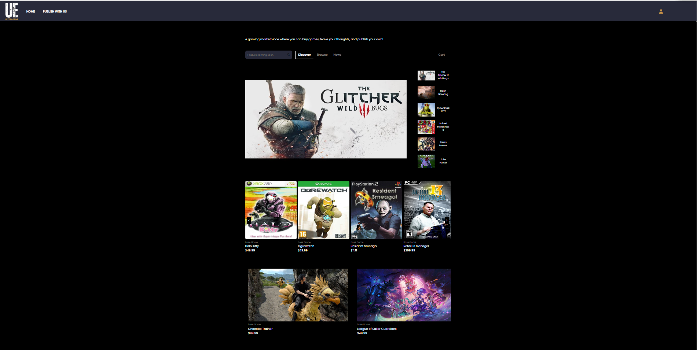
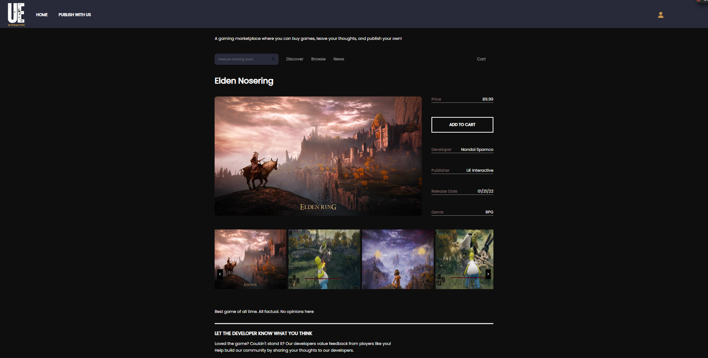
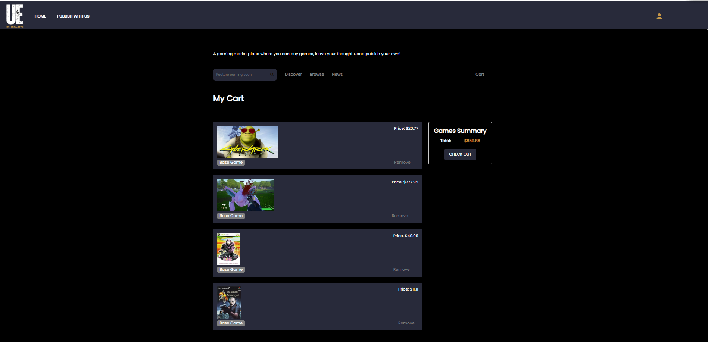

#Welcome to UntetheredEdge Games Store!
---

#About
---

This website uses Epic Games Store as inspiration for the layout and features. Users have a developer portal where they can create game information on the website, view what they have created, update the information, and delete the information as if they were developers publishing on the platform.  Users can also CREATE/READ/UPDATE/DELETE comments on the games. There is also a cart feature that allows users to add games to a cart and check them out. In the account page, users can view a transaction history of their orders.

#Technologies

#Website Preview
---

#Features

##Games

*Users can browse the games in the store
*Users can create a game by submitting a form
*Users can update a game through a form
*Users can delete their game from the site through the developer portal

##Comments

*Users can write comments for each game on the game details page
*Users can update comments through a modal form
*Users can view comments written by other users
*Users can delete their comments

##Cart and Orders

*Users can put games in their cart
*Users can remove games from their cart
*Users check out games from the cart
*Users are able to see their transaction history in the account page
